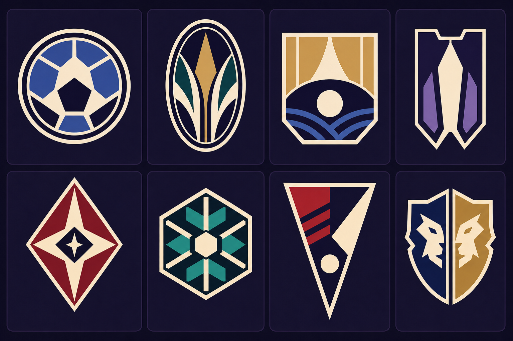
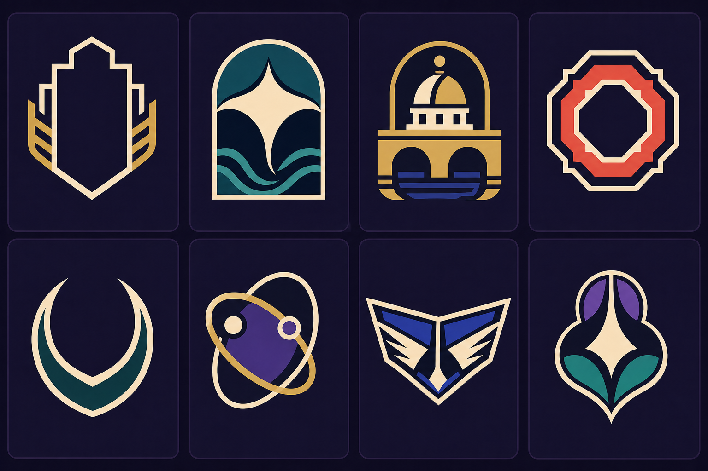
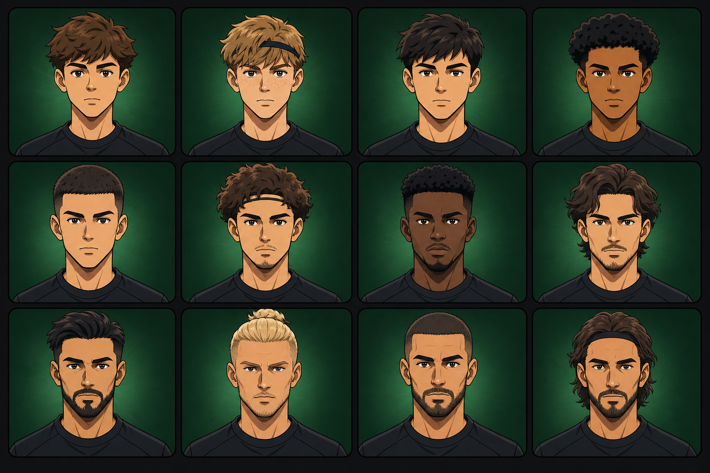

# ORION — Visual Identity Phase 1B

## Expanded emblem forms and fictional multinational newgens

Status: **exploration preview only; approval required before production catalog work**

This round adds 16 emblem-form directions and 12 fully fictional player portraits. It does not replace the six approved Phase 0/1 emblem directions, and it does not implement a resolver, catalog, persistence, migration, or the live-color fix.

## Boards

- [Approved Phase 0/1 emblem reference](./reference/approved-emblem-directions-board-phase-0-1.png)
- [Expanded emblem forms — Board A](./concepts/emblem-expanded-forms-board-a.png)
- [Expanded emblem forms — Board B](./concepts/emblem-expanded-forms-board-b.png)
- [Fictional multinational newgens](./concepts/fictional-multinational-newgens-board.png)







## 1. Emblem form exploration

The two new boards are additive. They widen the silhouette library beyond the approved shield, roundel, civic, geometric, animal, and abstract-knot directions.

| Asset | Concept ID | Tile | Form / metadata |
|---|---|---:|---|
| Board A | `EMB-1B-A01` | R1C1 | Double-ring roundel; strong circular read; abstract field geometry |
| Board A | `EMB-1B-A02` | R1C2 | Tall vertical oval; botanical/spear negative space |
| Board A | `EMB-1B-A03` | R1C3 | Broad flat-top shield; clipped lower corners; horizon geometry |
| Board A | `EMB-1B-A04` | R1C4 | Narrow notched shield; forked base; strong vertical axis |
| Board A | `EMB-1B-A05` | R2C1 | Diamond medallion; central four-point negative-space focus |
| Board A | `EMB-1B-A06` | R2C2 | Compact regular hexagon; radial mechanical/snowflake geometry |
| Board A | `EMB-1B-A07` | R2C3 | Long triangular pennant/container; asymmetric internal division |
| Board A | `EMB-1B-A08` | R2C4 | Bilateral split crest; mirrored fictional-animal geometry |
| Board B | `EMB-1B-B01` | R1C1 | Monogram-ready architectural container; intentionally blank center; no generated letters |
| Board B | `EMB-1B-B02` | R1C2 | Arched container with abstract winged-sea-creature/manta geometry |
| Board B | `EMB-1B-B03` | R1C3 | Fictional civic geometry: observatory dome plus twin bridge arches |
| Board B | `EMB-1B-B04` | R1C4 | Stepped octagonal badge with strong concentric negative space |
| Board B | `EMB-1B-B05` | R2C1 | Open crescent/capsule emblem; minimal outer silhouette |
| Board B | `EMB-1B-B06` | R2C2 | Asymmetric orbital knot; open/non-heraldic family |
| Board B | `EMB-1B-B07` | R2C3 | Wide winged trapezoid/standard; compact horizontal read |
| Board B | `EMB-1B-B08` | R2C4 | Three-lobed/trefoil crest with pointed base |

Production interpretation:

- Treat every tile as a silhouette hypothesis, not finished logo art.
- Redraw selected directions as audited SVG using genuinely flat colors, fewer paths, and explicit 16/24 px micro variants.
- AI-generated gradients/tonal variation visible in some preview tiles are not approved production styling.
- For a future monogram family, add licensed lettering as deterministic vector paths after selection; never ship generated pseudo-text.
- Run small-size, monochrome, color-vision, real-club similarity, and trademark review before catalog admission.

## 2. Portrait style and canonical fit

The canonical `PlayerFaceComponent` establishes the current visual principle:

- procedural inline SVG in a 100×100 view box;
- default `sports` style with sharp serious sports-anime/cel-shaded construction;
- dark plum-black ink, stronger sports-style stroke, one facial shadow plane, two-tone hair, and a separate hair highlight;
- angular but varied head/jaw geometry and a dark forest-green radial background.

Relevant source anchors are `src/app/player-face/player-face.component.ts:4-21`, `:100`, `:483-487`, and `:2183-2256`, plus `player-face.component.css:10-12`.

The Phase 1B board preserves that graphic grammar while deliberately rejecting the current idea that nationality should be recognizable from face structure, color, symbols, or species. All portraits were generated without country input. Real-country nationality was assigned afterward as external demonstration metadata.

## 3. Newgen asset and metadata mapping

Tile order is left-to-right, top-to-bottom. Names are omitted intentionally. Positions and countries are demonstration metadata only; they were not used to generate the faces and do not imply a physical profile for any nationality.

| Asset | Concept ID | Tile | Age | Position | Real-country nationality metadata | Region | Visual notes independent of nationality |
|---|---|---:|---:|---|---|---|---|
| Newgen board | `NG-1B-001` | R1C1 | 16 | MC | Romania | Europe | Youthful angular oval, short layered brown hair |
| Newgen board | `NG-1B-002` | R1C2 | 17 | AML | Brazil | South America | Freckles, fair skin, blond graphic hair, plain headband |
| Newgen board | `NG-1B-003` | R1C3 | 18 | DR | Japan | East Asia | Dark straight layered hair, narrow angular jaw |
| Newgen board | `NG-1B-004` | R1C4 | 19 | ST | Nigeria | West Africa | Deep skin tone, compact curls, broad jaw |
| Newgen board | `NG-1B-005` | R2C1 | 21 | GK | Argentina | South America | Close crop, tall narrow head, clean-shaven |
| Newgen board | `NG-1B-006` | R2C2 | 23 | AMC | France | Western Europe | Wavy hair, slim goatee, plain headband |
| Newgen board | `NG-1B-007` | R2C3 | 25 | DM | Morocco | North Africa | Deep skin tone, short coils, controlled beard |
| Newgen board | `NG-1B-008` | R2C4 | 27 | ML | South Korea | East Asia | Medium-length wave, light moustache/beard |
| Newgen board | `NG-1B-009` | R3C1 | 29 | DC | United States | North America | Swept dark hair, full graphic beard |
| Newgen board | `NG-1B-010` | R3C2 | 31 | AMR | Mexico | North America | Blond tied-back hair, restrained stubble |
| Newgen board | `NG-1B-011` | R3C3 | 33 | DC | Australia | Oceania | Close crop, mature forehead lines, full beard |
| Newgen board | `NG-1B-012` | R3C4 | 35 | ST | Ghana | West Africa | Long swept hair, plain headband, mature beard |

Important interpretation: the table does not assert that any facial trait is typical of the associated country. A production assignment service must be able to permute these country values without changing portrait eligibility.

Age treatment is restrained: R1 represents academy ages 16–19, R2 young/prime ages 21–27, and R3 mature professionals 29–35. The two minors are ordinary non-sexualized academy roster portraits.

## 4. Production-catalog recommendation

After visual approval:

1. Reconstruct selected emblems as SVG families; keep the old approved six and new selected forms in one additive silhouette catalog.
2. Export selected portrait directions as a versioned `sports-cel-v1` raster family at 64/128 px, with consistent crop/focal metadata.
3. Store visual identity separately from nationality:

```text
FaceAsset: assetKey, styleVersion, ageBand, crop, visualTags, provenance
PlayerAssignment: playerId, assetKey, catalogVersion
PlayerData: nationalityCountryCode (independent field)
```

4. Face eligibility may use age band and explicit fictional species/style, but not country, flag, name, ethnicity inference, or a country-weighted appearance table.
5. Persist the final assignment once and retain immutable catalog versions for saves. Do not generate images during gameplay.
6. Add human review for originality, public-person likeness, minor age appropriateness, demographic coverage, emblem similarity, and small-size performance.

## 5. Provenance and originality

- Tool mode: built-in image generation; three separate calls, one per new board.
- No public image, real footballer photo, logo library, club crest, or celebrity reference was used.
- Emblem boards used only the previously approved internal Phase 0/1 board as a **style/presentation reference**. Prompts explicitly prohibited copying or replacing its marks.
- The newgen board used no input image and no country list. Countries were attached afterward in this document as metadata.
- Visual inspection found no text/watermarks, real club marks, or obvious public-person likenesses. Production admission still requires human similarity/trademark review.
- Outputs are opaque RGB PNG previews at 1536×1024. They are not production assets or evidence of legal clearance.

## 6. Exact prompts

<details>
<summary>Expanded emblem forms — Board A</summary>

```text
Use case: logo-brand
Asset type: fictional football-club emblem exploration board, preview only
Input images: Image 1 is a STYLE AND PRESENTATION REFERENCE ONLY for the approved Phase 0/1 board. Preserve its dark charcoal-violet board, clean tile separation, bold flat sports-game grammar, and premium cohesion. Do not edit, repeat, trace, or replace any emblem from Image 1.
Primary request: create one NEW landscape board with exactly eight completely original emblem-form directions in a clean 4-column by 2-row grid. The eight new outer silhouette families must be visibly different and easy to classify: (1) double-ring roundel with abstract internal field geometry, (2) tall vertical oval medallion, (3) broad flat-top shield with clipped lower corners, (4) narrow notched shield with a forked base, (5) diamond medallion, (6) compact regular hexagon badge, (7) long triangular pennant/container, and (8) bilateral split crest whose left and right halves form one unified silhouette.
Style/medium: vector-friendly screen-printed logo concepts; hard clean edges; bold negative space; two or three truly solid spot colors per emblem; no photographic detail; each reads clearly at 24 px.
Composition/framing: eight equal separate tiles, centered marks, generous padding, opaque landscape board.
Color palette: varied but controlled navy, cream, gold, teal, red, cobalt, violet; each tile limited to 2–3 flat colors.
Constraints: all eight designs are supplementary to the approved board, not replacements. No words, no letters, no initials, no numerals, no faux writing, no captions, no real club or league cues, no flags, no brands, no sponsor marks, no watermarks, no signatures. No gradients, gloss, bevel, metallic shine, texture, shadows, 3D, mockups, thin hairlines, or tiny details. Original fictional geometry only.
```

</details>

<details>
<summary>Expanded emblem forms — Board B</summary>

```text
Use case: logo-brand
Asset type: second fictional football-club emblem exploration board, preview only
Input images: Image 1 is a STYLE AND PRESENTATION REFERENCE ONLY for the approved Phase 0/1 board. Use the same dark charcoal-violet board, clean separated tiles, bold premium sports-game coherence, and simple flat geometry. Do not edit, trace, repeat, or replace any emblem from Image 1, and do not repeat forms from the first new board.
Primary request: create one NEW landscape board with exactly eight additional original emblem directions in a clean 4-column by 2-row grid. Make the outer forms and internal concepts visibly distinct: (1) a monogram-ready architectural container with a strong blank central negative-space field but absolutely no letters, (2) an abstract fictional manta-ray or winged-sea-creature geometry inside an arched container, (3) abstract civic landmark geometry combining an observatory dome and twin bridge arches, (4) a stepped octagonal badge, (5) a crescent/capsule-shaped open emblem, (6) an asymmetric orbital-knot badge, (7) a wide winged trapezoid/standard, and (8) a compact three-lobed or trefoil crest with a pointed base.
Style/medium: vector-friendly screen-printed logo concepts; hard clean edges; bold negative space; two or three truly solid spot colors per emblem; no photographic detail; each reads clearly at 24 px.
Composition/framing: eight equal separate tiles, centered marks, generous padding, opaque landscape board.
Color palette: varied but controlled navy, cream, gold, teal, scarlet, cobalt, violet, coral; each tile limited to 2–3 flat colors.
Constraints: all designs supplement the approved directions. No words, letters, initials, numerals, faux writing, captions, flags, map outlines, real monuments, real animals drawn naturalistically, real club/league cues, brands, sponsor marks, watermarks, or signatures. No gradients, gloss, bevel, metallic shine, textures, shadows, 3D, mockups, thin hairlines, or tiny details. Original fictional geometry only.
```

</details>

<details>
<summary>Fictional multinational newgens</summary>

```text
Use case: stylized-concept
Asset type: fictional football-manager newgen portrait exploration board, preview only
Primary request: create one opaque landscape board containing exactly twelve completely invented football-player head-and-shoulders portraits in a strict 4-column by 3-row grid. Reading left-to-right, top-to-bottom, the intended ages are 16, 17, 18, 19, 21, 23, 25, 27, 29, 31, 33, and 35. Make age progression plausible and restrained: academy-youth proportions in the first row, young/prime adults in the second row, mature professionals in the third row; no childlike bodies and no premature old-age caricature.
Style/medium: match the PRINCIPLE and graphic language of an existing procedural 100x100 football-game face system: sharp serious sports-anime cel shading, bold dark plum-black ink outlines, angular but varied head and jaw silhouettes, simplified clean eyes/nose/mouth, focused neutral competitive expressions, one solid facial shadow plane, crisp two-tone graphic hair with a separate highlight shape, controlled color, visibly illustrated and game-authored. Not painterly, not 3D, not photorealistic, no skin pores or camera realism.
Composition/framing: twelve equal separated rounded-square portrait tiles; identical centered frontal head-and-shoulders crop, same eye line, scale, lighting direction, and dark forest-green radial background; plain charcoal unbranded training top in every tile.
Subjects: twelve distinct fictional masculine-presenting players with broad independent variation in skin tone, facial structure, hair texture, hairstyle, hair color, brows, grooming, and one or two subtle neutral sports headbands. Distribute all physical traits independently across the age grid. Keep every person generic and original, with no resemblance to any real footballer, celebrity, public figure, or known fictional character.
Metadata rule: do not depict, infer, imply, label, or stereotype nationality. Real-country nationality will be assigned later as external catalog metadata and must have no visual cue in the portraits.
Constraints: exactly 12 portraits, no text, names, letters, numerals, flags, country colors, national dress, team colors, crests, kit logos, sponsors, brands, tattoos, signatures, watermarks, trophies, stadiums, balls, UI frames, or captions. No real-person likeness, no photographic realism, no glamour styling, no caricature, and no sexualization. The 16–17-year-old entries must be ordinary age-appropriate academy roster portraits.
```

</details>

## 7. Verification record

- `npm ci` — PASS. The repository lockfile was used unchanged. npm reported the repository's existing audit findings; dependency remediation is outside this documentation-only exploration.
- `npm run build -- --configuration production` — PASS, production hash `8190ae0f59f465af`. Existing Angular warnings remain: three skipped selector rules, one autoprefixer `start` warning, the `app.component.css` budget warning, and the initial-bundle budget warning.
- `npm test -- --watch=false --browsers=ChromeHeadless --no-progress` — existing baseline remains red: `TOTAL: 26 FAILED, 39 SUCCESS` and the known full-page-reload message. This matches the canonical `main@81c3dde4cf6d45fe006fb37373793f01269f1da6` baseline recorded by the team; this exploration changes no application or test source.
- `npm test -- --watch=false --browsers=ChromeHeadless --no-progress --include='src/app/team-crest/team-crest.component.spec.ts'` — PASS, `TOTAL: 2 SUCCESS`; Karma still prints the known full-page-reload diagnostic while exiting successfully.
- Visual inspection — PASS: three new `1536 x 1024` RGB preview boards; 16 distinct new emblem directions across two boards; exactly 12 fictional portraits on the newgen board; the prior approved emblem board retained as a separate reference.
- Scope inspection — PASS: the intended patch contains only this document, the three new preview boards, and the retained approved emblem reference. No production source, tests, configuration, dependency manifest, or lockfile is changed.
