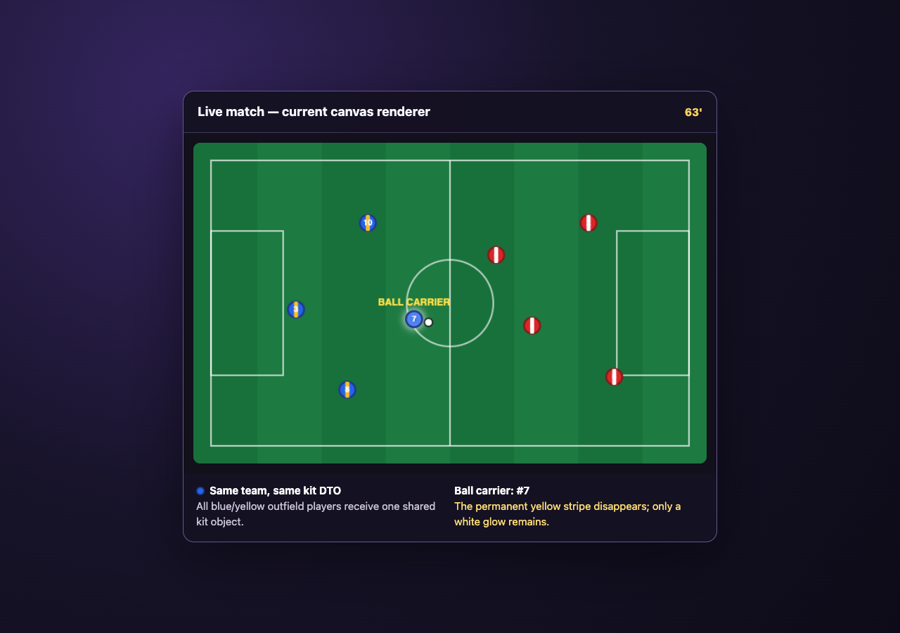
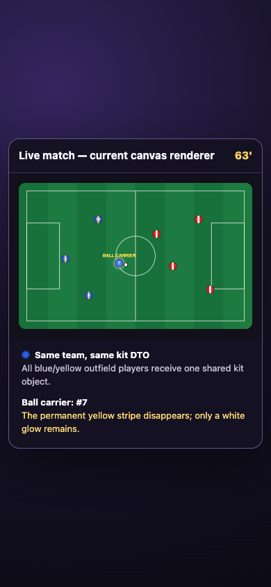

# ORION — Live-match active-player color diagnosis

Status: **Diagnosed and reproduced; no production fix in Phase 0/1**

Severity: **P1 visual clarity / accessibility**. Match data and scoring are not corrupted, but a core live-view identity cue becomes inconsistent precisely on the player the user is expected to follow.

## 1. Outcome

The backend sends one consistent outfield kit for each team. The frontend does not replace the ball carrier's primary color; it deliberately **omits the team's secondary stripe for `ballCarrierId`** while every other outfield teammate keeps that stripe. Because the stripe is a meaningful portion of a 16 px marker, the active player appears to wear a different kit/color.

The defect is therefore in the frontend canvas painter, not CSS specificity, backend team mapping, or stale frame state.

Expected behavior:

- All same-team outfield players retain the same base marker: primary fill, secondary stripe, and border.
- Goalkeepers may retain their intentionally separate goalkeeper kit.
- Active/ball-carrier involvement is added as a separate accent (ring/halo/chevron), never by removing or changing a base-kit channel.

Actual behavior:

- Inactive same-team outfielder: primary circle + secondary vertical stripe + team border.
- Active same-team outfielder: primary circle + team border + white glow, **without the secondary stripe**.

## 2. Reproduction evidence

The live modal depends on a mutable backend career/session and a generated attack event. To keep this diagnostic safe and deterministic, the browser reproduction used the exact production marker condition with controlled `GoalAnimationData`-equivalent values; it did not modify application source or game state.

Reproduction state:

```text
same scoringTeamId for players #3, #10, #7, #8
same TeamKit for all four:
  outfieldPrimary   = #2563eb
  outfieldSecondary = #fbbf24
  outfieldBorder    = #1e3a8a
frame.ballCarrierId = player #7
```

Observed result: #3, #10, and #8 are blue/yellow; #7 is plain blue with a white glow. The condition behaves the same at desktop and mobile viewport widths.

- [Desktop evidence — 1280×900](./evidence/live-color-desktop-current.png)
- [Mobile evidence — 390×844](./evidence/live-color-mobile-current.png)





The only browser console error was the temporary evidence page's missing favicon; it is unrelated to the canvas result.

## 3. Exact data flow

### 3.1 Backend kit and identity mapping

1. `LiveMatchSession` builds an animation with attacking/defending team IDs and stores it in `goalAnimations` (`LiveMatchSession.java:1249-1256`; similar branches cover save/miss/corner).
2. `GoalAnimationContext.toAnimPlayer()` copies the authoritative player ID and supplied team ID into `AnimationPlayer` (`GoalAnimationContext.java:142-150`). The V3 adapter likewise copies `PlayerSnapshot.teamId()` (`AnimationV3GoalAdapter.java:166-176`).
3. `GoalAnimationContext.attachKits()` loads both teams once, calls `TeamKitResolver.resolveKits()`, then attaches `kits[0]` and `kits[1]` as scoring/defending kits (`GoalAnimationContext.java:82-93`).
4. `TeamKitResolver` selects one outfield primary/secondary/border per side and resolves clashes before serializing (`TeamKitResolver.java:70-99`). It does not create an active-player kit.
5. `GoalAnimationData` carries `scoringTeamId`, `defendingTeamId`, the two `TeamKit` objects, ordered players, and per-frame `ballCarrierId` (`GoalAnimationData.java:24-39,67-102`).
6. `LiveMatchSession.buildResult()` exposes the animation map in `LiveMatchData` (`LiveMatchSession.java:1627-1637`).

### 3.2 Frontend selection and painting

1. `AppComponent.fetchLiveMatch()` receives `/match/live/{key}`; interactive polling later replaces it with `/advance` state (`app.component.ts:1047-1085,1182-1245`).
2. `playGoalAnimation()` selects the minute's animation and assigns it directly to `goalAnimationData` (`app.component.ts:1992-2005`).
3. The template displays a fixed 640×400 canvas, made responsive with `width: 100%; height: auto` (`app.component.html:700-710`; `app.component.css:1629-1641`).
4. `renderGoalFrame()` selects `scoringKit` or `defendingKit` solely from `player.teamId === scoringTeamId` (`app.component.ts:2215-2226,2251-2266`).
5. Every non-GK receives `outfieldPrimary` and `outfieldBorder` (`app.component.ts:2267-2273`). The carrier additionally receives a white shadow/glow (`2275-2283`).
6. The painter then draws the secondary stripe only when `secondary && !isBallCarrier` (`2285-2300`). The code comment explicitly says it is skipped for the ball carrier because the highlight already stands out.

That final condition is the defect.

## 4. Why the other hypotheses are excluded

| Hypothesis | Finding |
|---|---|
| Backend assigns the active player to the wrong team | Excluded for the reproduced state: team selection happens from the player's serialized `teamId`, and all same-team players select the same `TeamKit` object |
| Backend sends a separate active kit | Excluded: `GoalAnimationData.TeamKit` has only team outfield and goalkeeper fields; no active-player color exists |
| CSS overrides an inline marker color | Excluded: player pixels are imperatively drawn into a 2D canvas. CSS only sizes the canvas and supplies a background fallback |
| Canvas fill/stroke state leaks from the previous player | Excluded: fill/stroke are assigned for every player; shadow blur is reset; stripe clipping is wrapped in `save()`/`restore()` |
| Primary fill actually changes | Excluded: the active marker retains `outfieldPrimary`. Perceived color changes because the secondary stripe is removed |
| Goalkeeper mismatch | By design: `position === 'GK'` selects `gkPrimary/gkBorder`. Goalkeeper markers are not part of the same-outfield-kit invariant |

## 5. Root-cause classification

This is a **base-style/state-style coupling error**. The marker has three semantic layers:

1. identity: team kit;
2. role: goalkeeper vs outfield;
3. transient involvement: carrier/scorer/event.

The current painter implements involvement partly by changing identity (removing a kit stripe) and partly by adding an accent (white glow). Identity must be immutable within the frame; transient state must be additive.

The problem is visible at all responsive sizes because the internal bitmap remains 640×400 and CSS scales it. At smaller widths, losing a 4 px stripe has even greater perceptual impact relative to the marker.

## 6. Recommended Phase 4 fix

### 6.1 Preferred design

Refactor marker painting into explicit layers:

```text
drawBaseMarker(teamKit, role)        // always identical for the same team + role
drawShirtNumber(number, baseColor)
drawInvolvementAccent(state)         // ring/halo/chevron; never changes base fill/stripe
drawNameLabel(labelState)
```

For every non-GK, draw the secondary stripe unconditionally when it exists. For the carrier, add:

- an outer 2–3 px high-contrast double ring at `radius + 3`;
- the current soft glow on the ring, not as the only indicator;
- a small ball/chevron cue positioned outside the kit circle;
- optional pulse motion only when `prefers-reduced-motion` is false.

The accent must remain identifiable without color. A solid/dashed shape difference or chevron is preferable to glow alone. Scorer/assister/event accents should use the same additive model with a deterministic priority if states overlap.

Wrap each complete player paint in `ctx.save()`/`ctx.restore()` as defensive isolation. This is not the current root cause, but it prevents future line-dash, alpha, transform, shadow, or compositing leakage.

### 6.2 Minimal code-level correction

The smallest safe behavior change is to remove `!isBallCarrier` from the stripe condition, then paint a separate carrier ring after the base and number. Do not substitute `outfieldSecondary`, swap colors, increase alpha, or hide the border for active state.

Avoid solving this with CSS because CSS cannot address individual pixels/players inside the canvas. Avoid solving it in `TeamKitResolver` because the backend already supplies the correct team identity and should not know transient per-frame focus.

### 6.3 Suggested testability refactor

Extract a pure function:

```ts
markerStyleFor(player, frame, animation): {
  basePrimary: string;
  baseSecondary: string | null;
  border: string;
  role: 'OUTFIELD' | 'GK';
  accent: 'NONE' | 'CARRIER' | 'SCORER' | 'ASSISTER';
}
```

Unit tests can then assert semantic equality of base fields without brittle canvas pixel inspection. A small painter test can still verify that the stripe and ring are emitted in the correct order.

## 7. Regression matrix for Phase 4

### 7.1 Semantic unit tests

- Two scoring-team outfielders, one carrier: equal primary/secondary/border; accent differs only.
- Two defending-team outfielders, one carrier: same invariant.
- `ballCarrierId = 0` (ball in flight): no carrier accent and no base mutation.
- Carrier changes between consecutive frames: previous carrier loses only accent; new carrier gains only accent; base fields remain unchanged.
- Scorer is carrier; scorer is not carrier; assister is carrier; multiple transient states have documented accent priority.
- GK carrier edge case: goalkeeper kit remains different by role and receives an additive carrier accent.
- Missing `outfieldSecondary`: both same-team players consistently fall back to the same border/no-stripe rule.
- Missing kits from an old save: legacy scoring/defending fallbacks preserve the same-team invariant.

### 7.2 Canvas/pixel tests

- Sample pixels through the primary field, secondary stripe, border, and outer accent for carrier and non-carrier markers.
- Verify all player painters restore `globalAlpha`, shadow, line width, line dash, composite operation, transform, fill, and stroke state.
- Render at frame transitions before/after a pass to prove no residual glow or accent.
- Compare home/away combinations including same-family colors resolved by `TeamKitResolver`.
- Test primary/secondary pairs with light, dark, and low-saturation colors; number contrast remains readable.

### 7.3 Flow and responsive tests

- Open play, penalty, free kick, save, and miss animations.
- Legacy minute-keyed `goalAnimations` and ordered `canonicalAnimations` boundaries. Same-minute/multiple-goal ordering is a separate concern, but every entry must preserve marker identity.
- Two events at one minute (for example goal + full-time) and multiple animation phases queued in succession.
- Desktop 1280×900, tablet 768×1024, mobile 390×844, and high-DPR rendering.
- Modal resize/orientation change while an animation is active.
- `prefers-reduced-motion: reduce`: no pulse/scale animation; static ring and shape cue remain.
- Protanopia, deuteranopia, tritanopia, grayscale, and low-contrast simulation: involvement remains visible by outline/shape, while team identity remains stable.
- Keyboard skip/replay and repeated modal open/close do not carry accent state into a new animation.

### 7.4 Acceptance rule

For a fixed frame, every pair of same-team players with the same role must have identical base-marker pixels after normalization for position and shirt number. Transient state may change only pixels outside the base identity layer or within a dedicated, documented accent layer.

## 8. Related but separate observations

- The backend already resolves primary-kit clashes coarsely by color family and selects contrasting goalkeeper kits. A later accessibility phase should replace the coarse named-color classifier with measured color distance/contrast, but that is not needed to explain this bug.
- `LiveMatchData` exposes an ordered `canonicalAnimations` list for same-minute goals, while the inspected frontend paths still read the legacy `goalAnimations[minute]` map. This is an adjacent playback/order risk, not the marker-color root cause; do not couple its fix to the visual-layer patch without a separate review.

## 9. Phase boundary

No production source or test was changed. Phase 4 may implement the additive accent and tests after ATLAS review/approval. The two screenshots in this document are evidence assets only.
