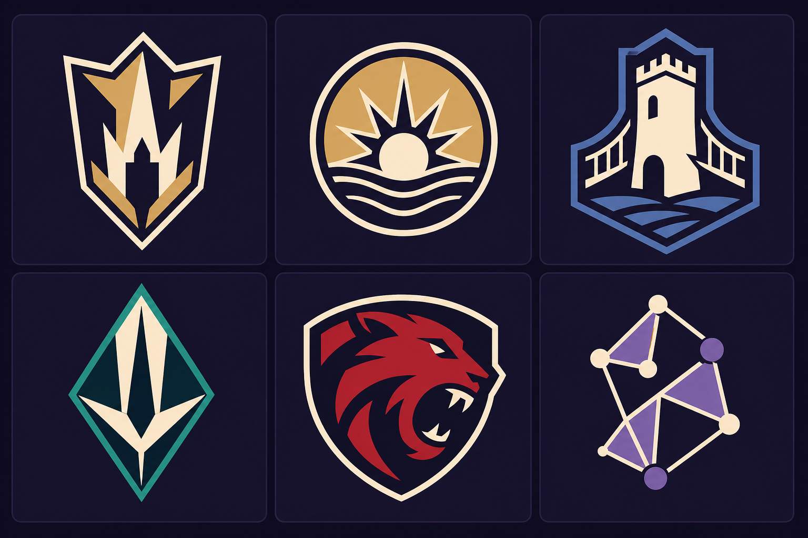
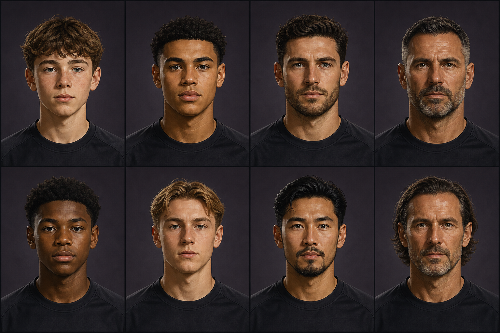

# ORION — Visual identity and newgen face generation specification

Status: **Phase 0/1 design only — approval required before production implementation**

Scope: club emblems and generated-player portraits. No production runtime code, schema, API, package, or generated production catalog is changed in this phase.

## 1. Decision summary

The current application has no production crest or portrait asset catalog. Club marks and player faces are assembled as inline SVG in Angular. This is lightweight and mostly deterministic, but it does not provide a durable, versioned identity: club colors vary by call site, names influence the zero-ID fallback, face rendering depends on which optional fields a page supplies, and changing the renderer can silently change old saves.

The recommended target is an **offline-curated, versioned asset catalog**:

1. Generate broad concept candidates offline; never call an image model during gameplay.
2. Human-review originality, safety, small-size readability, and cross-catalog collisions.
3. Reconstruct selected emblems as production SVG and export portraits as optimized WebP/AVIF with PNG fallback where required.
4. Publish immutable catalog versions and content-addressed files.
5. Assign an `assetKey` plus `catalogVersion` once, persist it, include it in saves/API responses, and resolve it in the frontend through one shared service.
6. Preserve every shipped catalog version needed by an old save; migration is explicit, previewable, and reversible.

The two images below are **direction boards, not shippable assets**:

- [Emblem directions](./concepts/emblem-directions-board.png)
- [Newgen face directions](./concepts/newgen-face-directions-board.png)





## 2. Current asset pipeline audit

### 2.1 Repository inventory

| Area | Current source | Format / dimensions | Runtime behavior | Main gap |
|---|---|---|---|---|
| Club crest | `src/app/team-crest/team-crest.component.{ts,html,css}` | Inline SVG, `viewBox="0 0 100 100"`; rendered at 21, 24, 25, 28, 30, 34, 46, 80, and 82 px | Eight procedural silhouettes, palette selected by `teamId % 8`, two-letter initials derived from display name | Only eight silhouette families; call sites disagree on colors; no persisted or versioned identity |
| Player face | `src/app/player-face/player-face.component.{ts,html,css}` | Large inline SVG string, `viewBox="0 0 100 100"`; observed at 26–128 px | Angular builds and sanitizes layered SVG from descriptor inputs | Optional inputs differ by page; no age input; renderer semantics are unversioned; SVG rebuilt by a getter |
| Raster/vector files | `src/favicon.ico`, duplicate under `docs/favicon.ico` | Both are actually 28×30 RGBA PNG files | Angular copies the favicon and `src/assets` | No crest/face assets, manifest, resolver, preload list, or failure state |
| Angular asset build | `angular.json:23-25` | `src/favicon.ico`, `src/assets`; production output hashing enabled | Build can fingerprint bundled files | There is no visual-identity catalog using this path |

No `.jpg`, `.jpeg`, `.webp`, or standalone `.svg` visual-identity assets were found. Existing `/api/assets/*` calls belong to the in-game economy/personal-assets feature and are not a graphical asset pipeline.

### 2.2 Club crest behavior and consistency

`TeamCrestComponent` selects one of eight variants using `abs(teamId || hashName()) % 8`. It accepts optional team colors, otherwise falling back to one of eight hard-coded palettes. It derives initials from `teamName` and validates only that a color string resembles a CSS color.

What is stable now:

- A positive, unchanged `teamId` chooses the same silhouette across reloads.
- The same supplied inputs render the same SVG; the focused crest test confirms deterministic fallback and accepted named colors.
- Inline SVG has no network-loading or cache-failure path.

What is not stable or consistent:

- Several routes pass `color1`/`color2` while Home and some league rows do not. The same team therefore uses API colors on one page and the component fallback palette on another.
- A `teamId` of zero hashes `teamName`; renaming/localizing the club can change the crest family.
- Eight variants guarantee high silhouette reuse. Initials help at large size but are weak at 21–25 px and collide for clubs with the same initials.
- Name-derived letters are embedded in the rendered mark, coupling identity to mutable/localized display data.
- Broad CSS-color validation accepts values such as `transparent` and does not enforce contrast, color-vision separation, or a minimum difference between primary/secondary.
- There is no `assetKey`, catalog version, manifest, deprecation record, ownership/licensing metadata, or centralized fallback.

### 2.3 Player face behavior and consistency

The backend persists compact descriptor columns on `Human`: `baseFaceId`, skin/hair/eye values, five shape values, and `species` (`Human.java:90-114`). `FaceGenerator.assignFace()` seeds `Random` from player ID, then selects nation-weighted shape/color pools (`FaceGenerator.java:108-130`). `HumanController` and other views expose those values. `Human` and `YouthPlayer` tables are included in game export/import, so assigned `Human` descriptors survive refresh, restart, and save/load.

The frontend receives those integers and builds a large SVG. Current call sites render between 26 and 128 px.

Important inconsistencies and gaps:

- `nationId` is passed on some pages but omitted on awards and match-ratings pages. Because nation changes geometry/signatures, the same persisted player can look different by route.
- The gallery supplies `nationId` but omits `species`; an exotic player can appear human there and non-human elsewhere.
- Some call sites coerce missing descriptors to zero. Unassigned players then share one all-zero face.
- `YouthPlayer` has no face descriptor or asset key. `YouthAcademyService.promoteToFirstTeam()`, `MinimumSquadService.createGraduate()`, and the admin create-player path save new `Human` records without calling `FaceGenerator`; those players keep default zero descriptors.
- No age is passed into the face component. Wrinkle detail is derived from a face seed rather than age, so a 15-year-old and a veteran can receive age-incompatible cues.
- `innerSvg` is a getter that rebuilds and sanitizes a substantial string during change detection. There is no memoized result, decoded-image cache, lazy loading, or low-resolution placeholder.
- The descriptor is persisted but the renderer/catalog semantics are not versioned. A code deployment can change the same integer tuple into a different face for every old save.
- Current backend and frontend intentionally tie facial structure, skin/hair distributions, species, symbols, and recognizability to nation. This is a stereotyping risk and must not be carried into a realistic human portrait catalog.

### 2.4 Current determinism and persistence verdict

| Question | Current answer |
|---|---|
| Same club after refresh? | Usually, if `teamId`, name fallback, and supplied colors are unchanged |
| Same club across pages? | Silhouette yes for positive ID; colors and complete appearance no |
| Same existing player after refresh/save-load? | Usually yes because `Human` descriptor columns persist |
| Same player across pages? | Not guaranteed because call sites omit `nationId`, `species`, or shape inputs |
| Same youth before/after promotion? | No durable youth identity; promotion paths can create the shared all-zero descriptor |
| Same old save after renderer update? | Not guaranteed; no catalog/renderer version is persisted |
| Browser/network caching? | Not relevant for inline SVG; there is also no catalog-level cache or invalidation model |

## 3. Style bible — club emblems

### 3.1 Design principles

- **Silhouette first:** recognition must survive at 24 px without letters, tiny interior details, or color alone.
- **Original fiction:** no recognizable real-club outline/detail combination, league trophy, flag, protected character, sponsor, or near-copy.
- **Two or three flat colors:** one dominant field, one contrast mark, optional neutral outline. Production SVG has no raster texture, bevel, gloss, or photographic detail.
- **One visual idea per mark:** an emblem may use a tower, animal, horizon, knot, or crystal—not a pile of unrelated symbols.
- **Consistent family grammar:** a shared stroke/negative-space system should make the catalog feel authored, while silhouette families prevent repetition.

### 3.2 Approved direction families for Phase 2 exploration

1. Angular shield.
2. Circular roundel.
3. Civic landmark badge.
4. Geometric crystal/chevron.
5. Fictional animal mascot.
6. Non-alphabetic abstract knot/constellation.

The board contains one example of each family. It is deliberately broad. Selection does not authorize direct tracing: chosen ideas must be redrawn into clean vectors, checked for similarity, and simplified at target sizes.

### 3.3 Construction rules

- Master artboard: SVG `viewBox="0 0 128 128"`, optically centered inside a 112×112 safe zone.
- Minimum external padding: 8 units at master scale.
- Minimum feature width: 6 units; minimum negative-space gap: 5 units.
- Maximum practical path count: 18; no linked fonts or external references.
- Production variants: full color, one-color light, one-color dark, and optional 16/24 px micro variant.
- Text/initials, if the selected system needs them, are added later as audited vector paths from a licensed type source; AI-generated text is prohibited.
- Test sizes: 16, 21, 24, 32, 46, 64, 80, and 128 px on light, dark, and green-pitch backgrounds.
- Color contrast: outline/field and primary/secondary boundaries target at least 3:1 for meaningful graphical distinctions; identity must also survive monochrome and simulated protanopia/deuteranopia/tritanopia.

### 3.4 Palette governance

- Catalog stores semantic swatches (`field`, `mark`, `outline`) rather than arbitrary CSS strings.
- Team kit colors may tint an approved neutral template only when that template was designed for tinting. A club's actual emblem assignment is not recomputed from a route's transient color inputs.
- A palette linter rejects transparency, malformed CSS values, near-identical swatches, low luminance contrast, and colors outside the allowed gamut.
- Two teams in one match can still share colors; matchup kit resolution is a separate runtime concern and must not silently replace their crest assets.

## 4. Style bible — generated-player portraits

### 4.1 Selected direction

Use a coherent **stylized semi-realistic editorial sports portrait**: head-and-shoulders, centered eye line, neutral/focused expression, restrained texture, dark neutral background, plain unbranded top, and clear features at 48–128 px. It should feel more grounded than the current anime renderer while staying visibly illustrated rather than photorealistic.

### 4.2 Age bands and metadata axes

The catalog must explicitly tag age presentation:

- `ACADEMY_15_17`
- `YOUNG_18_24`
- `PRIME_25_32`
- `VETERAN_33_PLUS`

Permitted independent metadata axes include skin tone band, face-shape family, hair texture, hairstyle, hair color, eye-region family, grooming, accessibility notes, and fictional species/style variant where the game design requires it. These axes are selected independently and audited for coverage.

Nationality must not select or weight human skin tone, facial structure, hair texture, grooming, or age cues. Names, flags, team, and national identity remain separate game data. Fictional non-human species may have dedicated catalogs, but species membership must be explicit fiction—not a proxy for a real ethnicity or nationality.

### 4.3 Age and sensitive-content rules

- Academy players are ordinary, non-sexualized roster portraits with age-appropriate proportions, clothing, expression, and grooming.
- No glamour styling, suggestive pose, exposed torso, fetish styling, or adult-coded facial hair on 15–17 entries.
- Aging is gradual: no wrinkles in academy assets; limited maturation in 18–24; subtle structure/grooming in 25–32; restrained lines/grey in 33+.
- No grotesque deformation, humiliation, disability caricature, racialized exaggeration, or emotion tied to a demographic group.
- Catalog QA measures representation across the whole set and within each age band. It does not infer or label a real person's ethnicity.
- Every portrait is fictional; reject real-person likenesses and candidates with a credible resemblance to public figures.

### 4.4 Technical crop and exports

- Opaque square master, recommended 1024×1024, with a fixed face/eye-line template and 12% headroom safe area.
- Export 128×128 and 64×64 AVIF/WebP; optional 32×32 micro crop; PNG fallback only where browser/support requirements justify it.
- Use perceptual review at 48, 64, 96, and 128 px. Reject features that exist only at master resolution.
- Store focal point and safe-crop metadata even when initially centered.
- A portrait asset never contains a name, shirt number, flag, crest, sponsor, signature, or watermark.

## 5. Target deterministic catalog architecture

### 5.1 Separation of concerns

```text
offline generation -> human review -> vector/raster production -> immutable catalog manifest
                                                        |
entity creation -> deterministic candidate selection -> collision check -> persisted assignment
                                                        |
API {assetKey,catalogVersion} -> shared FE resolver -> lazy/preload/cache -> fallback
```

Generation is an authoring workflow. Assignment is backend game logic. Rendering is a frontend asset-resolution concern. Runtime gameplay never depends on an external image-generation service.

### 5.2 Manifest contract

Illustrative catalog record:

```json
{
  "catalogVersion": "faces-human-v1",
  "assetKey": "face-human-a15-17-0042",
  "kind": "PLAYER_FACE",
  "files": {
    "32": "sha256-…-32.webp",
    "64": "sha256-…-64.webp",
    "128": "sha256-…-128.avif",
    "fallback": "sha256-…-128.webp"
  },
  "metadata": {
    "ageBand": "ACADEMY_15_17",
    "style": "EDITORIAL_V1",
    "focalPoint": [0.5, 0.42]
  },
  "provenance": {
    "source": "ORIGINAL_GENERATION_AND_HUMAN_REDRAW",
    "reviewState": "APPROVED",
    "licenseOwner": "PROJECT",
    "promptRevision": "orion-phase1-r1"
  }
}
```

Persist on each relevant entity (or a dedicated `VisualIdentityAssignment` table):

```text
entityType, entityId, assetKind, assetKey, catalogVersion,
assignmentSeedVersion, assignedAt, migratedFromKey?, overrideReason?
```

Backend/API dependencies for Phase 2/3:

- Team: persisted crest key and version, exposed in every team-summary/view model.
- Human: persisted face key and version, assigned after the ID exists.
- YouthPlayer: persisted face key/version at prospect creation so the same person keeps the same portrait on promotion.
- Promotion, minimum-squad graduate, admin-create, bootstrap, import, and repair/backfill paths must all use one assignment service.
- Save export/import manifest must include these fields/table; import validates referenced catalog versions before commit.
- Frontend uses one typed resolver/component contract rather than route-specific optional descriptor wiring.

### 5.3 Deterministic assignment

Use a stable keyed hash such as:

```text
candidateIndex = HMAC-SHA256(worldSeed, entityType | entityId | assetKind | assignmentSeedVersion)
                 mod eligibleCandidateCount
```

The hash produces a candidate only. The final `assetKey` and catalog version are persisted once. Future code, team renames, display-language changes, or catalog growth do not recompute existing assignments.

Eligibility for a human face includes the explicit age band and style/species catalog, but not nationality. If a player's age crosses a band, keep the assigned identity by default; an explicit age-progression migration can map to a reviewed sibling asset set while preserving an `identityFamilyKey`.

### 5.4 Collision control

- Club crests require catalog-wide uniqueness at the silhouette/mark level. Before assignment, reserve used keys; deterministic linear probing selects the next eligible unused key. If capacity is exhausted, fail the creation workflow with a visible operational alert rather than silently duplicate.
- Faces can repeat only above a defined population threshold. Prefer a large catalog and track recent/team-local use. Probe away from the same key and from high-similarity siblings within the same squad/competition.
- Store perceptual hashes/embedding similarity for review and assignment. Reject near-duplicate crests; apply a configurable distance floor for faces.
- Deterministic probing order is derived from the original hash, so recovery/backfill is reproducible.

### 5.5 Old saves, catalog upgrades, and migration

- Catalog versions are immutable. Never replace the file or meaning behind an existing `(catalogVersion, assetKey)` pair.
- Content removal becomes a tombstone with a safe replacement mapping; the original remains available for saves unless legal/safety removal requires quarantine.
- Loading an old save first resolves its stored version. If present, appearance is byte-stable. If missing, the loader uses a version-specific migration map and records the migration.
- No silent global remap on deploy. Offer a migration preview with counts, unavailable items, and a reversible save checkpoint.
- Current descriptor-based saves can be imported into a `procedural-v1` compatibility catalog. A later user-approved migration may assign new curated assets, recording old descriptor values and the replacement key.
- Missing/corrupt references use a deterministic, entity-distinguishable fallback—not one shared silhouette/face—and emit telemetry without blocking save load.

## 6. Delivery, caching, and performance

- Files are content-addressed and served with `Cache-Control: public, max-age=31536000, immutable`.
- Versioned manifests use ETag and a short controlled TTL; a changed manifest always receives a new version identifier.
- Preload only assets above the fold and the two teams/starting lineup needed for the imminent live match. Lazy-load roster lists with `loading="lazy"`/intersection observation and reserve dimensions to prevent layout shift.
- Keep a memory map from `(version,key,size)` to resolved URL and rely on the browser HTTP cache for bytes. Do not rebuild large inline SVG strings on every change detection.
- Responsive selection uses `srcset`/`sizes`; 32/64/128 variants prevent downloading 1024 px masters into list rows.
- Suggested initial budgets: crest SVG gzip ≤ 8 KB each; face 64 px ≤ 12 KB WebP, face 128 px ≤ 30 KB AVIF/WebP; one roster view should avoid more than roughly 0.5 MB uncached portrait transfer.
- Prefetch is cancellable and network-aware. Under `saveData` or slow connections, request the smallest adequate variant.
- On error, retain layout and show the deterministic fallback; retry only with bounded backoff. A broken asset must not trigger assignment mutation.

## 7. Originality, licensing, and provenance

- No public image source, scraped dataset, logo library, or real-player photo was used in Phase 1.
- Both boards were created with the built-in image-generation tool from text-only prompts; no reference images were supplied for the initial generations. The emblem correction used only the first internally generated board as its edit reference.
- Generated candidates are not assumed to be legally clear or production-ready. Before shipping: perform reverse-image/similarity review, trademark review for crest silhouettes, real-person-likeness review for portraits, and retain approval records.
- Record tool/model mode, exact prompts, output hash, reviewer, revisions, redraw source file, and license/ownership statement in the manifest provenance.
- Never generate or preserve AI-rendered text, sponsor marks, flags, watermarks, signatures, real club cues, or celebrity likenesses.

## 8. Phase 1 generation record

### 8.1 Emblem board

Final preview: `docs/orion-visual-identity/concepts/emblem-directions-board.png`

Mode: built-in image generation, text-to-image initial pass plus one permitted image-edit correction.

Initial pass output was rejected for dimensional shading and a letter-like abstract mark. The correction flattened/simplified the board and replaced the abstract tile. Residual tonal variation is a generator artifact; it reinforces why the board is directional only. Production reconstruction must use truly flat SVG colors.

Initial prompt:

> Create a single polished landscape concept board for a fictional football-management game. The board contains exactly six clearly separated club-emblem direction tiles in a clean 3-by-2 grid. Each tile shows one fully original, fictive emblem with a genuinely distinct silhouette family: (1) classic angular shield, (2) circular roundel, (3) civic tower or bridge badge, (4) sharp geometric crystal/chevron badge, (5) bold fictional animal mascot badge, and (6) abstract interlocking monogram-like symbol made only from non-letter geometric forms. Flat graphic design, vector-friendly construction, strong outer silhouettes that remain recognizable at 24 pixels, controlled negative space, limited to two or three solid colors per emblem, consistent premium sports-game art direction, no gradients inside emblems, no tiny details, no thin hairline strokes. Present on an opaque dark charcoal-violet board with subtle tile separators and generous padding. IMPORTANT: absolutely no words, no letters, no initials, no numbers, no captions, no real club crests, no league marks, no brand references, no flags, no watermarks, no signatures, and no UI mockup. This is a direction/mood board only; do not imply production-ready logos. Original fictional visual language, crisp edges, centered emblems, balanced composition.

Correction prompt:

> Edit this concept board while preserving its landscape 3-by-2 layout and the six distinct emblem families. Correct only these issues: remove every gradient, highlight, gloss, bevel, metallic effect, texture, shadow, and dimensional shading from the emblems; redraw each emblem as crisp flat vector-style shapes using only two or three truly solid colors. Simplify any tiny architectural or animal details that would disappear at 24 pixels. Redesign the bottom-right abstract tile so it is an asymmetrical non-alphabetic geometric knot/constellation shape that cannot be read as any letter, initial, or numeral. Keep the opaque dark charcoal-violet board, subtle tile separators, centered marks, generous padding, and strong silhouette variety. Absolutely no text, letters, initials, numerals, captions, real clubs, brands, flags, signatures, or watermarks.

### 8.2 Newgen face board

Final preview: `docs/orion-visual-identity/concepts/newgen-face-directions-board.png`

Mode: built-in image generation, text-to-image, no correction.

The board passed visual inspection: exactly eight fictional portraits, consistent crop/lighting/background, two entries in each age column, broad variation independent of nationality, plain tops, and no visible text/marks or recognizable public-person likeness.

Prompt:

> Create one polished landscape concept board containing exactly eight fully fictive football-player head-and-shoulders portraits in a precise 4-column by 2-row grid. Each portrait occupies an equal separate tile, with consistent centered crop, eye line, neutral forward-facing expression, soft three-quarter studio key light, opaque muted charcoal/plum background, and the same coherent premium sports-management illustration style: stylized semi-realistic editorial painting with clean shapes, restrained texture, readable at 48–128 pixels, not photography and not anime. The four columns represent age progression without labels: column 1 has two age-appropriate academy players aged 15–17, column 2 two young professionals aged 18–24, column 3 two prime players aged 25–32, column 4 two veterans aged 33+. Make age cues believable and respectful: youthful facial proportions for minors, subtle maturation through the adult groups, only restrained lines/grey at veteran age; no caricature and no premature ageing. Across the eight portraits show broad, balanced variation in skin tone, facial structure, hair texture, hairstyle, eye area, and grooming, distributed independently of age and with no flags, national dress, nationality cues, ethnic stereotypes, or one-to-one demographic coding. Plain unbranded dark training tops only; no team colors, crests, sponsor marks, league marks, text, captions, letters, numbers, signatures, or watermarks. No real people, celebrities, public figures, or recognizable likenesses. The 15–17-year-old portraits must be unmistakably age-appropriate, non-sexualized, and presented exactly like ordinary academy roster headshots. Consistent lighting, scale, crop, and background across all eight tiles; opaque board, no transparent areas, no UI mockup.

## 9. Approval gates and phased implementation

### Phase 2 — catalog and data contract (backend-dependent)

- Select/reject direction families and portrait style.
- Produce a small reviewed production pilot: at least 24 unique crests across all families and at least 64 human portraits balanced across age bands.
- Define manifest schema, provenance records, perceptual-collision thresholds, budgets, and immutable hosting path.
- Add backend assignment/persistence/save migration and API fields behind a feature flag.
- Backfill only in a copy of representative saves; compare before/after and provide rollback.

### Phase 3 — frontend resolver and rollout

- Add typed catalog client, shared crest/face components, responsive sources, preloading/lazy loading, deterministic fallback, failure telemetry, and accessibility labels.
- Keep current procedural renderer as `procedural-v1` compatibility until old-save migration is approved.
- Roll out behind a separate visual-catalog flag; test mixed old/new saves and catalog-version coexistence.

### Phase 4 — polish and scale

- Expand the approved catalog, run full similarity/legal/safety review, tune memory/network budgets, and add age-progression sibling sets if approved.
- Remove compatibility code only after save-version support policy allows it.

## 10. Acceptance criteria before any production rollout

- One persisted `(catalogVersion, assetKey)` resolves identically across every route, refresh, restart, and save/load.
- Club rename/localization and team-color call-site omissions do not change its crest.
- A youth prospect retains the same identity through promotion.
- No player defaults to a shared all-zero face because one creation path omitted assignment.
- Nationality has no effect on human physical-appearance selection.
- Every 15–17 portrait passes age-appropriateness review.
- Every crest passes 24 px silhouette, monochrome, contrast, and color-vision checks.
- No generated text, real-club cue, public-person likeness, watermark, or undocumented source reaches the catalog.
- Missing/versioned-out assets fall back deterministically without rewriting saved assignments.
- An old save can load with its original catalog or an explicit reversible migration; deployment alone never changes appearance.
- Asset loading meets agreed page-transfer, decoded-memory, layout-shift, and error-rate budgets.

## 11. Phase 1 verification record

- Branch/base checked against the assigned SHA before work.
- `npm run build -- --configuration production`: passes; existing CSS/bundle budget warnings remain.
- Full canonical frontend suite: `26 FAILED, 33 SUCCESS`, matching the pre-existing baseline recorded for the base commit (missing test providers/declarations and full-page reload behavior).
- Focused crest spec: both assertions execute successfully; Karma still logs the existing full-page-reload runner error.
- Exactly two final concept PNGs are present, both opaque RGB at 1536×1024. No production source, test, configuration, dependency manifest, or lockfile was changed.
